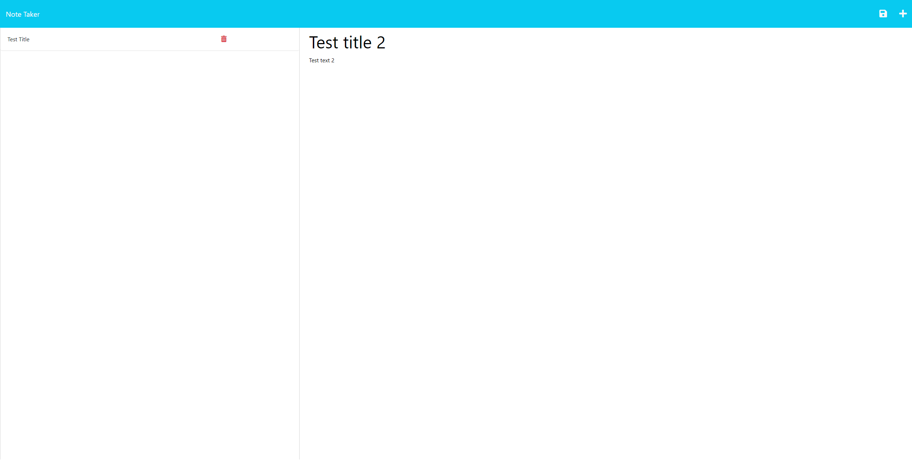

# NotePad
  
  ## Description
  This application allows you to create notes to better organize your day. It also helps to better understand how the client interacts with the server
  ## Table of Contents
- [Installation](#installation)
- [Usage](#usage)
- [Iicense](#Iicense)
- [How to contribute](#how-to-contribute)
- [Tests](#tests)
- [Questions](#questions)
## Installation
Installation not needed
## Usage
Open page and write notes

  
## Iicense
None
## How to contribute
N/A
## Tests
N/A
## Questions
* Github: https://github.com/Unk171
* Heroku: https://polar-forest-89089-257cc9f894ba.herokuapp.com
* You can send your questions to my e-mail: 7353687@gmail.com
  